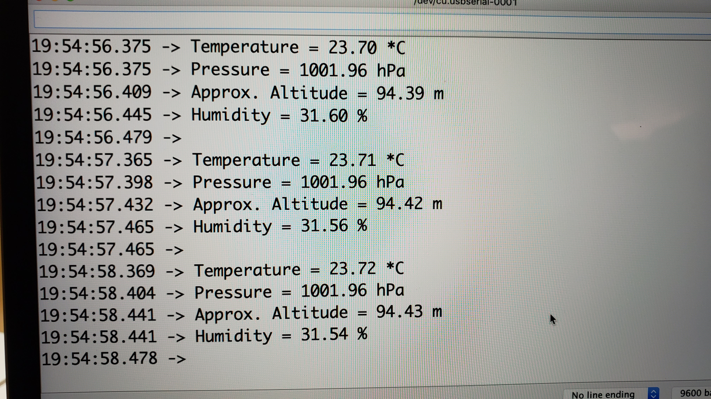
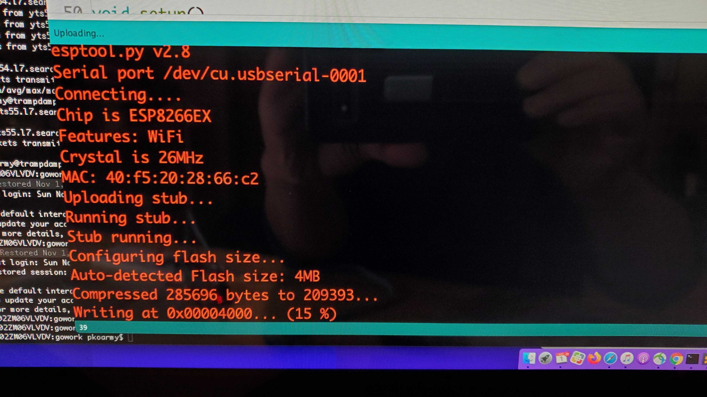
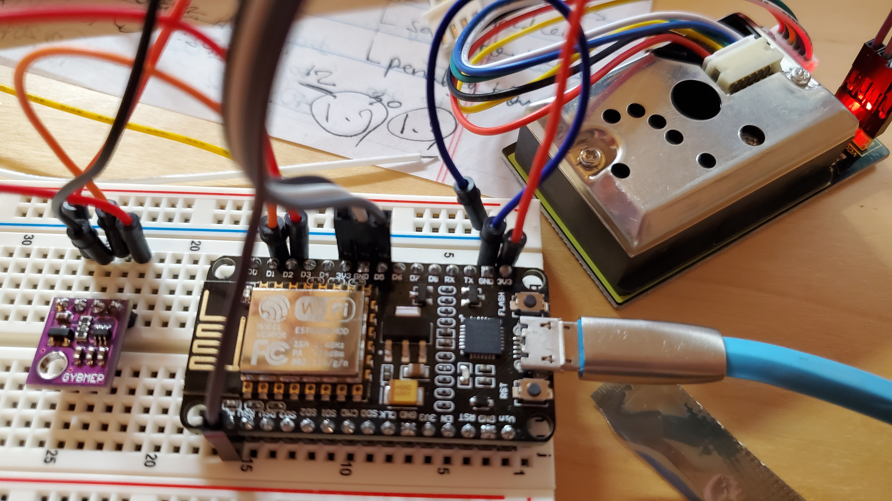
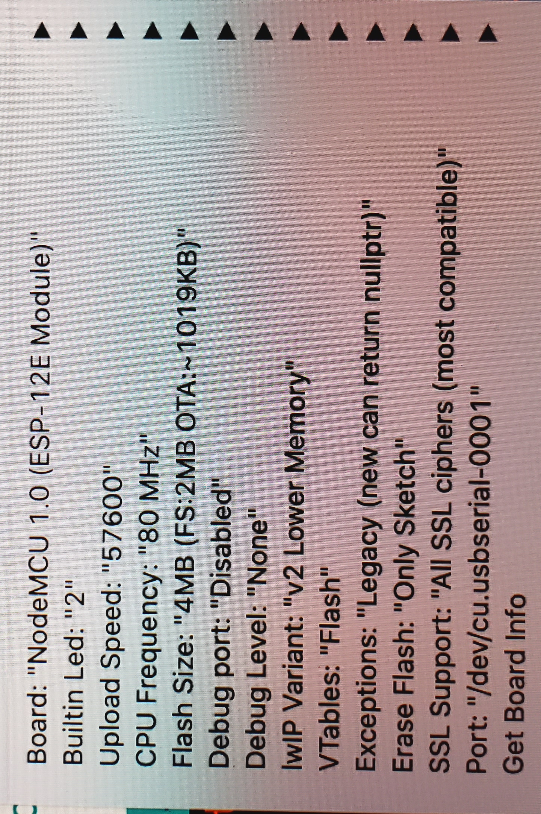

# ESP8266
Project using ESP8266

```
20:56:47.559 -> ...............................................
20:56:48.413 -> 53.00
20:56:48.413 -> 0.23
20:56:48.450 -> -0.06
20:56:48.450 -> 38.90
20:56:48.450 -> -61.00
20:56:48.450 -> 24455.16
20:56:48.488 -> Temperature =  75.0
20:56:48.488 -> Humidity =  31.5
20:56:48.521 -> Pressure = 1002.0
20:56:48.521 -> Pressure Inch = 29.59
20:56:48.555 -> Dew Point =  50.3
20:56:48.555 -> ...............................................
```

# Serial monitor


# Uploading


# Schematic


# Tool setting


# References
- https://randomnerdtutorials.com/esp8266-pinout-reference-gpios/
- https://github.com/nodemcu/nodemcu-devkit-v1.0
- https://github.com/esp8266/Arduino/releases/download/2.4.0-rc2/package_esp8266com_index.json
- https://lastminuteengineers.com/bme280-esp8266-weather-station/
- https://how2electronics.com/iot-air-pollution-monitoring-esp8266/
- https://randomnerdtutorials.com/esp8266-nodemcu-bme680-web-server-arduino/
- https://circuits4you.com/2019/01/09/nodemcu-esp8266-oled-display-code-example/
- http://www.howmuchsnow.com/arduino/airquality/
- https://github.com/PaulZC/GP2Y1010AU0F_Dust_Sensor
- https://github.com/supprot/ArducamSSD1306